# Hive Salon — Enterprise Multi-Branch Salon, Spa & Clinic Management ERP

> **A Next-Generation Commercial SaaS Platform for Luxury Salon Networks, Aesthetic Clinics & Wellness Chains.**

[-emerald.svg)](#)
[](#)
[](#)
[](#)

---

## 🌟 Executive Overview

**Hive Salon** is a centralized, multi-tenant enterprise ERP platform engineered specifically for high-volume luxury salon chains, medical aesthetic clinics, day spas, and personal grooming franchises. 

Built with strict multi-tier geographic isolation (Organization ➔ State ➔ District ➔ City ➔ Branch), Hive Salon eliminates the operational friction of salon management through:
- **Zero-Training Front-Desk Receptionist Experience**: Intuitive 9-step guided workflow, speed dial quick actions (`Alt+A`), interactive onboarding tour (`Alt+T`), and searchable in-app knowledge base (`Alt+H`).
- **Omnichannel Sales & Fulfillment**: Integrated customer storefront with in-store branch pickup OTP/QR verification, multi-carrier courier dispatch, and zero-oversell synchronized inventory.
- **Dynamic Commission Engine**: Progressive revenue slabs, multi-stylist line-item attribution, double-entry commission ledgers, and automated refund clawbacks.
- **Hive Salon AI (BI & Text-to-SQL)**: Read-only business analytics with natural language queries, 5 machine learning predictive forecasting models, and automated strategic insights.
- **Enterprise Customer Retention**: 6 membership archetypes, prepaid wallets with zero-negative-balance enforcement, multi-session service packages, and 4-tier loyalty ledgers.

---

## 🏗️ Architecture & Technology Stack

```
Hive Salon Monorepo (Turbo + npm workspaces)
├── apps/
│   ├── api/                 # NestJS 10 Core REST API & Business Logic
│   ├── web-admin/           # Next.js 15 App Router Backoffice & Console
│   ├── web-pos/             # Next.js 15 Tablet & Front-Desk POS Terminal
│   └── customer-portal/     # Next.js 15 Luxury Guest Portal & Storefront
└── packages/
    ├── types/               # Universal TypeScript Domain Definitions
    ├── database/            # PostgreSQL Schema & Prisma ORM Client
    ├── ui/                  # Luxury Tailwind Component Library & Design System
    ├── auth/                # Multi-Tenant RBAC & ScopeGuard Engine
    ├── validation/          # Zod Request Validation Schemas
    ├── utilities/           # Currency, Dates, Tax & Error Formatter Utilities
    ├── events/              # Event Bus & Decoupled Domain Events
    ├── config/              # Shared ESLint, Prettier, & TypeScript Configs
    └── audit/               # Immutable Security & Compliance Audit Logging
```

| Layer | Technology | Details |
| :--- | :--- | :--- |
| **Monorepo Build** | Turborepo 2.10 + npm Workspaces | Remote caching, task pipelining, and parallel builds |
| **Backend Core** | NestJS 10, TypeScript, Node.js 20 | Modular architecture with dependency injection |
| **Frontend Apps** | Next.js 15 (App Router), React 19 | Server/Client components, SSR, and dynamic streaming |
| **Database & ORM** | PostgreSQL 16, Prisma ORM 6.19 | Multi-tenant schema, foreign keys, and indexes |
| **Styling & Design** | Vanilla Tailwind CSS, Lucide Icons | Luxury dark glassmorphism, curated HSL color tokens |
| **Event Bus** | Node.js EventEmitter / Redis BullMQ | Decoupled event-driven marketing, stock, and audits |

---

## ⚡ Quick Start & Local Development

### Prerequisites
- Node.js >= 20.0.0
- npm >= 10.0.0
- PostgreSQL >= 15.0

### Installation & Launch

```bash
# 1. Clone the repository
git clone https://github.com/hive-salon/hive-salon.git
cd "Hive Salon"

# 2. Install monorepo dependencies
npm install

# 3. Generate Prisma Database Client
npm run db:generate

# 4. Build all packages and applications
npm run build

# 5. Start development servers in parallel
npm run dev
```

### Access Ports & Applications
- **Admin Console**: `http://localhost:3000` (Backoffice, Operations, AI, Finance)
- **Point of Sale (POS)**: `http://localhost:3001` (Front-Desk Billing Terminal)
- **Guest Portal & Storefront**: `http://localhost:3002` (E-Commerce, Booking)
- **Core REST API**: `http://localhost:4000/api/v1` (NestJS Gateway)

---

## 🧭 Operational Modules Breakdown

```mermaid
graph TD
    A[Hive Salon Core ERP] --> B[Multi-Branch Operations]
    A --> C[Customer CRM & Retention]
    A --> D[Point of Sale & Finance]
    A --> E[Inventory & Procurement]
    A --> F[Staff & Commissions]
    A --> G[Hive Salon AI]

    B --> B1[Geographic Tree Hierarchy]
    B --> B2[Appointment Diary & Calendars]
    B --> B3[Online Guest Booking Portal]

    C --> C1[Customer 360 Omnichannel History]
    C --> C2[Prepaid Wallets & Loyalty Points]
    C --> C3[Marketing Automation & Reviews]

    D --> D1[18% GST Invoicing & Split Payments]
    D --> D2[Multi-Carrier Retail Fulfillment]
    D --> D3[Financial Period Audits & Ledgers]

    E --> E1[Backbar Service Consumption Recipes]
    E --> E2[Atomic Multi-Branch Stock Sync]
    E --> E3[Inter-Branch Stock Transfers]

    F --> F1[Progressive Commission Slabs]
    F --> F2[Multi-Stylist Attribution Splits]
    F --> F3[Biometric Attendance & Payroll]

    G --> G1[Text-to-SQL Natural Language Queries]
    G --> G2[Predictive ML Forecasting Suite]
    G --> G3[Zero-Mutation Security AST Validator]
```



---

## ⌨️ Global Keyboard Shortcuts

| Shortcut | Action | Description |
| :--- | :--- | :--- |
| `Ctrl + K` | **Global Command Palette** | Instant search across Customers, Staff, Services, Invoices, and Branches |
| `Ctrl + /` | **Contextual Help Drawer** | Screen-specific operational guide explaining "What is this?" and "How it works" |
| `Alt + A` | **Global Quick Actions** | Speed dial modal to launch New Appointment, New Sale, Customer, or Staff |
| `Alt + H` | **In-App Help Center** | Searchable knowledge base covering 10 major operational domains |
| `Alt + T` | **Guided Product Tour** | Interactive 8-step walkthrough of the entire system |
| `Alt + R` | **Receptionist 9-Step Guide** | Step-by-step SOP drawer for front-desk staff |

---

## 🛡️ Enterprise Security & Compliance

- **Multi-Tenant Isolation**: Programmatically enforced `organization_id` foreign key predicates on every query.
- **Geographic RBAC Scoping**: Scopes users by `Organization` ➔ `State` ➔ `District` ➔ `City` ➔ `Branch`.
- **Zero-Mutation AI**: Hive Salon AI strictly rejects `INSERT`, `UPDATE`, `DELETE`, `DROP`, `ALTER`, `TRUNCATE`, comments (`--`, `/*`), and multi-statements (`;`).
- **Account Lockout**: 5 consecutive failed attempts trigger temporary lockout.
- **Audit Logging**: Immutable tracking of every write, role modification, discount override, and AI query.

---

## 📚 Complete Documentation Suite

- [ARCHITECTURE.md](docs/ARCHITECTURE.md) — Modular Monolith Blueprint & Monorepo Design
- [DATABASE.md](docs/DATABASE.md) — Schema Reference, Entity Relations & Ledgers
- [SECURITY.md](docs/SECURITY.md) — RBAC Scope Guards, Threat Modeling & AST Validator
- [API.md](docs/API.md) — REST API Endpoints & Request/Response Contracts
- [DEPLOYMENT.md](docs/DEPLOYMENT.md) — Production Deployment, Docker & PostgreSQL Setup
- [USER_GUIDE.md](docs/USER_GUIDE.md) — Zero-Training Receptionist & Stylist Handbook
- [ADMIN_GUIDE.md](docs/ADMIN_GUIDE.md) — Enterprise Multi-Branch Configuration Manual
- [TROUBLESHOOTING.md](docs/TROUBLESHOOTING.md) — Diagnostics, Error Codes & Operational Playbooks

---

## 📄 License & Commercial Rights

Copyright © 2026 Hive Salon Technologies. All rights reserved. Commercial Enterprise License.
