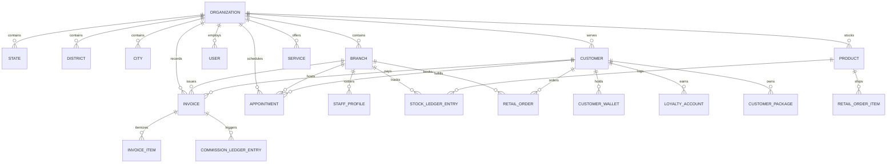

# Hive Salon — Database Schema & Data Dictionary

## 1. Overview & Data Model Design

The Hive Salon database runs on **PostgreSQL 16** managed via **Prisma ORM**. It features 40+ normalized domain models engineered for multi-tenant SaaS operations, double-entry financial/inventory ledgers, and fast geographic tree lookups.

All tenant-scoped tables enforce a non-nullable `organizationId` foreign key and include indexing on `[organizationId, createdAt]`, `[organizationId, branchId]`, and operational status columns.

---

## 2. Core Entity Relationship Map



---

## 3. Database Domain Tables Reference

### 1. Geographic & Multi-Branch Hierarchy
- **`organizations`**: Master tenant record (`id`, `name`, `code`, `businessType`, `currency`, `timezone`, `taxSettings`, `isSetupComplete`).
- **`states`**: State territorial jurisdiction (`id`, `organizationId`, `name`, `code`, `status`).
- **`districts`**: District territorial division (`id`, `organizationId`, `stateId`, `name`, `code`).
- **`cities`**: City municipal boundary (`id`, `organizationId`, `districtId`, `name`, `code`).
- **`branches`**: Physical salon, spa, or clinic location (`id`, `organizationId`, `cityId`, `name`, `code`, `phone`, `email`, `address`, `businessHours`, `isMain`, `isActive`).

### 2. Access Control & Identity (RBAC)
- **`users`**: System login accounts (`id`, `organizationId`, `email`, `fullName`, `role`, `failedLoginAttempts`, `lockedUntil`, `isActive`).
- **`user_scopes`**: Granular geographic access permissions (`id`, `userId`, `scopeType` [ORGANIZATION, STATE, DISTRICT, CITY, BRANCH], `scopeId`).
- **`custom_roles`**: Dynamic permission configurations (`id`, `organizationId`, `name`, `permissions` JSON).
- **`sessions`**: Active JWT session tokens with revocation timestamps.

### 3. Customers & Retention Suite
- **`customers`**: Client profiles (`id`, `organizationId`, `firstName`, `lastName`, `phone`, `email`, `tier`, `gender`, `hairProfile` JSON, `patchTestHistory` JSON, `totalSpend`, `visitCount`).
- **`customer_wallets`**: Prepaid cash/credit balances (`id`, `customerId`, `currentBalance`, `currency`, `status`).
- **`wallet_ledger_entries`**: Double-entry wallet audit log (`id`, `walletId`, `amount`, `resultingBalance`, `type`, `referenceId`).
- **`loyalty_accounts`**: Points balance (`id`, `customerId`, `pointsBalance`, `lifetimeEarned`, `tier`).
- **`customer_packages`**: Multi-session service bundles (`id`, `customerId`, `packageTemplateId`, `totalSessions`, `usedSessions`, `remainingSessions`, `expiryDate`).
- **`family_plans`**: Shared pool permissions (`id`, `primaryCustomerId`, `memberCustomerId`, `sharedWallet`, `sharedDiscount`).

### 4. Services, Appointments & Rostering
- **`services`**: Service catalog treatments (`id`, `organizationId`, `categoryId`, `name`, `sku`, `durationMinutes`, `bufferMinutes`, `basePrice`, `taxRate`, `genderCategory`).
- **`appointments`**: Scheduling diary entries (`id`, `organizationId`, `branchId`, `customerId`, `primaryStylistId`, `startTime`, `endTime`, `status` [SCHEDULED, CONFIRMED, IN_SERVICE, COMPLETED, NO_SHOW, CANCELLED], `totalPrice`).
- **`staff_profiles`**: Stylist/therapist records (`id`, `organizationId`, `branchId`, `userId`, `designation`, `commissionPlanId`, `skills` JSON, `baseSalary`).
- **`staff_attendance`**: Biometric check-in/out timestamps (`id`, `staffId`, `date`, `checkInTime`, `checkOutTime`, `status`).

### 5. Point of Sale (POS) & Invoicing
- **`invoices`**: Tax-compliant billing documents (`id`, `organizationId`, `branchId`, `customerId`, `invoiceNumber`, `subtotal`, `taxTotal`, `discountTotal`, `grandTotal`, `paymentMethod`, `paymentStatus` [PAID, PARTIAL, REFUNDED, VOID], `createdAt`).
- **`invoice_items`**: Line items with stylist attribution (`id`, `invoiceId`, `itemType` [SERVICE, PRODUCT, PACKAGE, MEMBERSHIP], `itemId`, `staffId`, `quantity`, `unitPrice`, `taxAmount`, `totalPrice`).
- **`commission_ledger_entries`**: Immutable staff commission records (`id`, `staffId`, `invoiceId`, `commissionAmount`, `type` [CREDIT, CLAWBACK_REVERSAL], `status`).

### 6. Inventory & Retail E-Commerce
- **`products`**: Retail & backbar catalog (`id`, `organizationId`, `name`, `sku`, `barcode`, `costPrice`, `retailPrice`, `minStockLevel`, `isBackbar`, `isRetail`).
- **`stock_ledger_entries`**: Double-entry inventory transactions (`id`, `productId`, `branchId`, `quantityChange`, `resultingStock`, `transactionType`, `referenceId`).
- **`retail_orders`**: Storefront & pickup orders (`id`, `organizationId`, `branchId`, `customerId`, `orderNumber`, `fulfillmentType` [BRANCH_PICKUP, HOME_DELIVERY], `pickupOtp`, `carrierId`, `awbNumber`, `status` [PLACED, CONFIRMED, PACKED, READY_FOR_PICKUP, OUT_FOR_DELIVERY, DELIVERED, CANCELLED, RETURNED]).
- **`retail_order_items`**: Order line items (`id`, `orderId`, `productId`, `quantity`, `unitPrice`, `totalPrice`).

### 7. Governance, Audits & AI
- **`audit_logs`**: System-wide compliance trail (`id`, `organizationId`, `userId`, `action`, `resource`, `resourceId`, `oldData` JSON, `newData` JSON, `ipAddress`).
- **`ai_audit_logs`**: Hive Salon AI query logging (`id`, `organizationId`, `userId`, `question`, `intent`, `generatedSql`, `executionTimeMs`, `rowCount`, `status`, `securityContext` JSON).

---

## 4. Indexing & Optimization Strategy

1. **Multi-Tenant Composite Indexes**:
   ```sql
   CREATE INDEX idx_appointments_org_branch_time ON appointments (organization_id, branch_id, start_time);
   CREATE INDEX idx_invoices_org_branch_created ON invoices (organization_id, branch_id, created_at);
   CREATE INDEX idx_stock_ledger_prod_branch ON stock_ledger_entries (product_id, branch_id, created_at);
   ```
2. **Search Performance**:
   ```sql
   CREATE INDEX idx_customers_phone_email ON customers (organization_id, phone, email);
   CREATE INDEX idx_products_sku_barcode ON products (organization_id, sku, barcode);
   ```
3. **Partitioning Readiness**:
   - `invoices`, `appointments`, and `stock_ledger_entries` are architected to support PostgreSQL monthly range partitioning when database sizes exceed 50M records.
